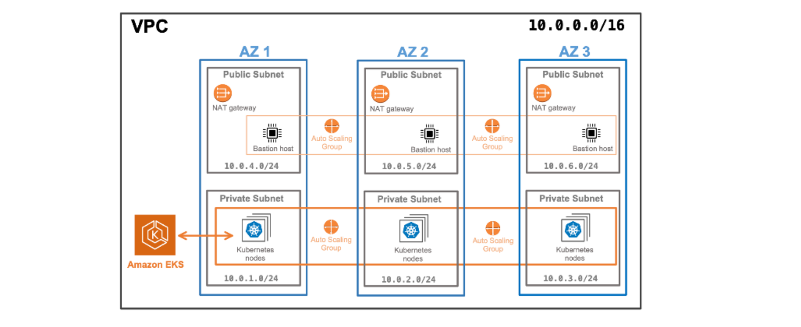

# Create an EKS Kubernetes Cluster with Terraform



**Note:** Visit the [official HashiCorp documentation](https://developer.hashicorp.com/terraform/tutorials/kubernetes/eks) for latest syntax updates.

## 1. Requirements

* Terraform v1.3+ installed locally
* An AWS account
* the AWS CLI v2.7.0/v1.24.0 or newer, [installed](https://docs.aws.amazon.com/cli/latest/userguide/getting-started-install.html) and [configured](https://docs.aws.amazon.com/cli/latest/userguide/cli-chap-configure.html)
* [AWS IAM Authenticator](https://docs.aws.amazon.com/eks/latest/userguide/install-aws-iam-authenticator.html)
* [kubectl](https://kubernetes.io/docs/tasks/tools/) v1.24.0 or newer


## 2. Prepare Configuration

* Open "variables.tf" and add the `default` credentials and `region` of your AWS IAM user:

    ```hcl
    variable "access_key" {
    type        = string
    default     = "your-access-goes-here"
    description = "Access Key ID"
    }

    variable "secret_key" {
    type        = string
    default     = "your-secret-key-goes-here"
    description = "Secret Key"
    }

    variable "region" {
    description = "AWS region"
    type        = string
    default     = "us-east-2"
    }
    ```

## 3. Initialize Configuration

* Run `terraform init` to initialize the configuration. Then run `terraform plan` to see what resources terraform will provision.

    ```bash
    # Run
    terraform init

    # Then
    terraform plan
    ```

## 4. Provision the EKS Cluster

* Run `terraform apply` to create the cluster and all the supporting resources. Confirm the operation with a `yes` when prompted:

    ```bash
    terraform apply
    ```

## 5. Configure kubectl

* After provisioning the cluster, we need to make it accessible with `kubectl`.
* You need the `region` and `cluster_name` outputs from `outputs.tf` to configure `kubectl`. 

* Retrieve the cluster's access credentials produced by `outputs.tf` and use them to configure `kubectl`. Run the command:

    ```bash
    aws eks --region $(terraform output -raw region) update-kubeconfig \
        --name $(terraform output -raw cluster_name)
    ```
* That's it! Your local `~/.kube/config` file is now updated with the access credentials to your new cluster.


## 6. Connect to the Cluster

* You can now use `kubectl` to access your new cluster:

    ```bash
    # Get cluster info
    kubectl cluster-info

    # Get cluster nodes
    kubectl get nodes
    ```

## 7. Destroy All Resources

**Warning:** [AWS EKS clusters cost $0.10 per hour](https://aws.amazon.com/eks/pricing/) so remember to delete your infrastructure after use.


* Run `terraform destroy` to destroy the cluster and all the supporting resources. Confirm the operation with a `yes` when prompted:

    ```bash
    terraform destroy
    ```